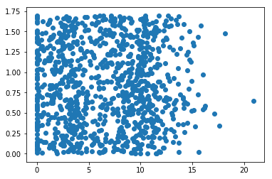

# k-邻近算法概述
##                 将文本文件进行收集、准备及分析，然后将其分组并对算法进行训练、测试及使用，最终我们会得到一个合适的模型。


```python
%matplotlib inline
```


```python
import kNN
```


```python
datingDataMat, datingLabels = kNN.file2matrix('datingTestSet2.txt')
```


```python
import matplotlib
```


```python
import matplotlib.pyplot as plt
```


```python
fig = plt.figure()
```


    <Figure size 432x288 with 0 Axes>


```python
ax = fig.add_subplot(111)
```


```python
from matplotlib.pyplot import scatter
```


```python
ax = scatter(datingDataMat[:,1], datingDataMat[:,2])
```





```python
ax = scatter(datingDataMat[:,1], datingDataMat[:,2], 15.0*array(datingLabels), 15.0*array(datingLabels)）
```


      File "<ipython-input-11-ee82748ef338>", line 1
        ax = scatter(datingDataMat[:,1], datingDataMat[:,2], 15.0*array(datingLabels), 15.0*array(datingLabels)）
                                                                                                               ^
    SyntaxError: invalid character in identifier
    

